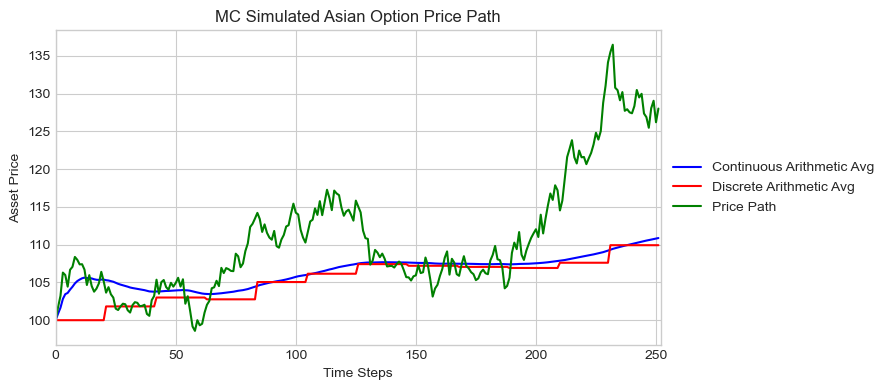
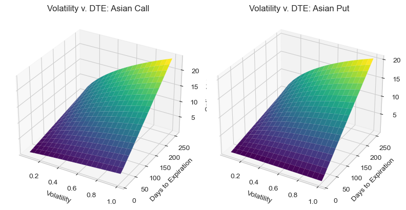

# MC_OptionsPricing
Monte Carlo simulation used to price path dependent Asian and Lookback options

This file is used to simulate the price of certain path-dependent, exotic options using Monte Carlo simulation. 

The underlying asset price evolution is simulated using the Euler-Maruyama scheme, such that the initial Brownian motion

$$
dS_t = rS_{t}dt + \sigma{S_t}d{W_t}
$$

is simulated as 

$$
S_{t+\partial{t}} = S_{t}e^{((r - \frac{1}{2}\sigma^2)\partial{t} + \sigma\sqrt{{\partial}t}{w_t})}
$$

This is the governing equation for the Monte Carlo simulations. 

Parameters can be adjusted to take account for differences in underlying volatility, risk-free rate, TTE, S0, K, and of course the desired number of path simulations. 

  
   
  <em>Figure 1: Individual simulated price path of an Asian option using discrete and continuous sampling</em>

Option prices are calculated to account for differences in contract structure, e.g. if the average price path for an Asian option is calculated discretely or continuously, using geometric or arithmetic averaging, etc. 

Hypothetical price surfaces are generated to visualize the change in value of a given option with respect to changes in volatility and time to expiry.

  
   
  <em>Figure 2: Monte Carlo simulated price surface of Asian call and put</em>

